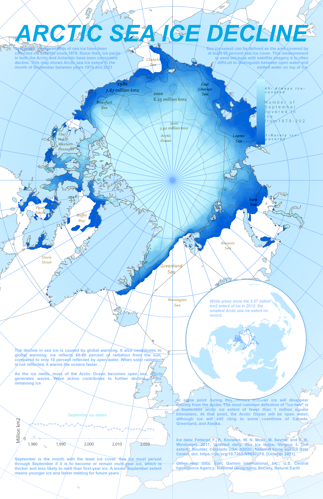

🙋‍♂ **About Me**
----
🗺️ **Data Analyst | GIS Professional | BI Strategy** 📈

Hello! I'm Babafemi, a passionate Data Analyst and GIS professional focused on merging data and geography to optimize planning. I leverage a comprehensive stack—including the ArcGIS suite, QGIS, Tableau, Power BI, Excel and SQL—to perform advanced spatial analysis and create compelling data visualizations. Highly analytical and dedicated to actionable solutions.

I am detail-oriented, analytical, and highly collaborative, ensuring data-driven insights translate into actionable solutions. My experience spans industries such as consulting, education, and retail, where I have successfully developed impactful analytics solutions.

Welcome to my portfolio, where I showcase my projects, achievements, and passion!

----
----

🧠 Proficiencies
----
**Data Analysis & Modeling:** Analyze complex datasets, including spatial data, to identify trends, patterns, and anomalies. Expertise in ETL processes and modeling using Python, SQL, and QGIS.

**Geospatial & BI Visualization:** Create dynamic and insightful visualizations for both tabular and location-based data. Tools include Tableau, Power BI, Excel, and the ArcGIS Ecosystem (Dashboards, Story Maps, Web Maps).

**Spatial Intelligence & Strategy:** Develop data-driven strategies utilizing geographic context. Implement solutions using ArcGIS Pro/Online/Enterprise for advanced analysis, data collection workflows, and supporting key business decisions.

**SQL & Data Management:** Efficiently query and manage data across various database systems (including spatial databases) using robust SQL practices.

----
----

💡 **Projects**
---
👔 **[Austria Employment Insight](https://github.com/sunday2023539/Spatial_Data_Infrastructure)**

🦟 **[Malaria Incidence in Nigeria](https://geoportal22s.zgis.at/portal/apps/storymaps/stories/adb2b64fc6ce4c9eb186a9d026ec240e)**

🗳️ **[Nigeria Democracy](https://storymaps.arcgis.com/stories/d248b3d798bb4da7aabfd84203edb504)**

📍 **[Great Places to explore in Summer](https://github.com/sunday2023539/Great-Places-to-explore-in-Summer)**

🗺️ **[Dasymetric Mapping of Salzburg city](https://github.com/sunday2023539/Dasymetric-Mapping-for-Detailed-Population-Distribution-in-Salzburg-City-)**
   
⚽ **[2022-2023-Football-Transfer-Market-Analysis](https://github.com/sunday2023539/2022-2023-Football-Transfer-Market-Analysis)**

---
---

### 📊 Tableau Visualization**
----

    
     
    **Football Transfer Analysis**

https://github.com/sunday2023539/sunday2023539/

## 🔑 Key Projects

### 🗺️ Featured Geospatial Dashboard: Malaria Risk Monitoring

----
----

### 🌊 Arctic Sea Ice

----
----

## 🗣️ Languages

English (Advanced)

German (Basic)

