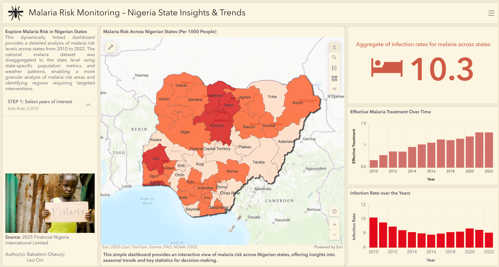

🙋‍♂ **About Me**
----
🗺️ **Data Analyst | GIS Professional | Remote Sensing** 📈

Hello! I'm Babafemi, a passionate and analytical professional dedicated to merging data and geography to optimize planning and decision-making.

My focus is on Location Intelligence, utilizing a robust technical stack to transform spatial, business, and Remote Sensing data into compelling, actionable insights.

Core Expertise
I specialize in performing advanced spatial analysis and generating impactful data visualizations that drive organizational strategy. My detail-oriented and collaborative approach ensures that analytical insights are practical and readily translatable into solutions.

----
----

🧠 Proficiencies
----
**Data Analysis & Modeling:** Analyze complex datasets, including spatial data, to identify trends, patterns, and anomalies. Expertise in ETL processes and modeling using Python, SQL, and QGIS.

**Geospatial & BI Visualization:** Create dynamic and insightful visualizations for both tabular and location-based data. Tools include Tableau, Power BI, Excel, and the ArcGIS Ecosystem (Dashboards, Story Maps, Web Maps).

**Spatial Intelligence & Strategy:** Develop data-driven strategies utilizing geographic context. Implement solutions using ArcGIS Pro/Online/Enterprise for advanced analysis, data collection workflows, and supporting key business decisions.

**SQL & Data Management:** Efficiently query and manage data across various database systems (including spatial databases) using robust SQL practices.

**Remote Sensing and Imagery Analysis:** Interpret and process satellite and aerial imagery (e.g., Landsat, Sentinel) for applications such as Land Use/Land Cover classification, environmental monitoring, and change detection analysis using specialized software.

----
----

💡 Projects
---
👔 **[Austria Employment Insight](https://github.com/sunday2023539/Spatial_Data_Infrastructure) SDI**

🦟 **[Malaria Incidence in Nigeria](https://geoportal22s.zgis.at/portal/apps/storymaps/stories/adb2b64fc6ce4c9eb186a9d026ec240e)**

🗳️ **[Nigeria Democracy](https://storymaps.arcgis.com/stories/d248b3d798bb4da7aabfd84203edb504)**

📍 **[Great Places to explore in Summer](https://github.com/sunday2023539/Great-Places-to-explore-in-Summer)**

🗺️ **[Dasymetric Mapping of Salzburg city](https://github.com/sunday2023539/Dasymetric-Mapping-for-Detailed-Population-Distribution-in-Salzburg-City-)**
   
⚽ **[2022-2023-Football-Transfer-Market-Analysis](https://github.com/sunday2023539/2022-2023-Football-Transfer-Market-Analysis)**

---
---

### 📊 Tableau Visualization
----
### ⚽ 

## 🔑 Key Projects

### 🗺️ Featured Geospatial Dashboard: Malaria Risk Monitoring

----
----

## 🗣️ Languages

English (Advanced)

German (Basic)

